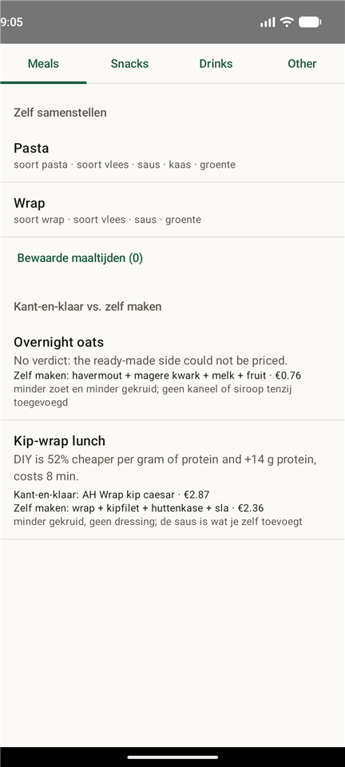
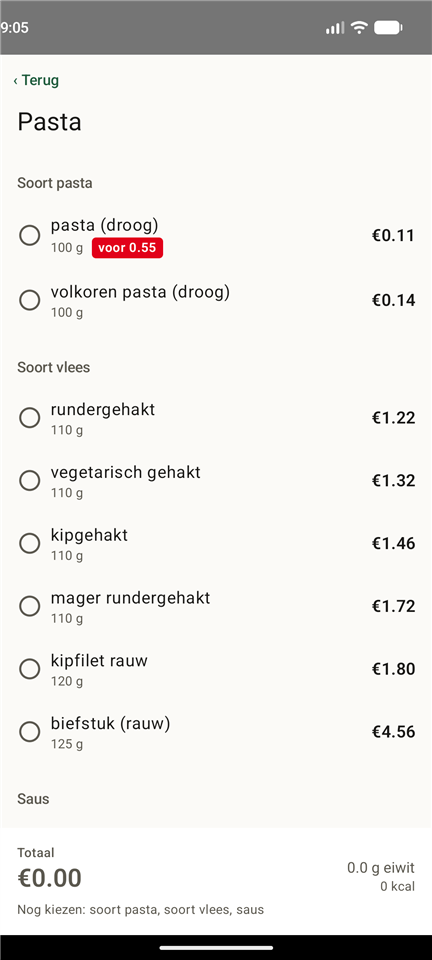
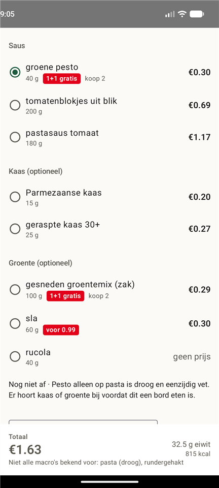
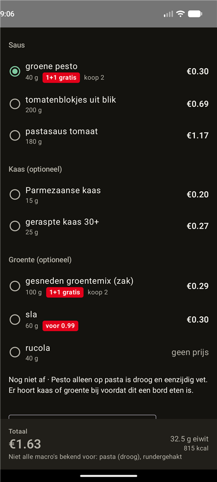

# MacroFinder

Tracks Dutch supermarket promotions (Albert Heijn, Jumbo, Aldi) and ranks food by
protein-per-euro. Two parts:

- **`bonusrank`** (`src/bonusrank/`) - a Python CLI that scrapes the three chains'
  promo data, parses prices and macros, and ranks what's currently on offer.
- **MacroFinder** (`android/`) - a Kotlin/Jetpack Compose Android app that shows
  that data as a browsable, filterable list: tabs for meals, snacks, drinks, and
  everything else, each item showing its price, which promo applies and why it's
  cheaper, and its macros. It does not pick meals for you - you filter and choose.

## The app

Real screenshots, running on an emulator against live Albert Heijn data.

| Meals | Build your own |
|---|---|
|  |  |

| Combination rules | Dark mode |
|---|---|
|  |  |

Three things those screens are doing on purpose:

- **The red chip is the only saturated colour in the app**, and it is the chain's
  own: red at Albert Heijn, yellow at Jumbo, blue at Aldi, exactly as on the shelf.
  `koop 2` next to a `1+1 gratis` is there because that deal means two jars in your
  fridge, not one cheap one.
- **Unknowns are shown, never hidden.** `rucola - geen prijs` stays in the list,
  ranked last. One unpriced line makes the whole total unknown rather than quietly
  summing the rest.
- **Rules explain, they never block.** *"Pesto alleen op pasta is droog en eenzijdig
  vet"* is a sentence a person wrote in `data/seed/templates.yaml`. You can still
  cook it.

## How data gets from one to the other

There is no backend server. A scheduled GitHub Actions job
(`.github/workflows/refresh-data.yml`) runs the CLI's full pipeline (scrape, parse,
match, price, rank) and writes a single JSON snapshot to `docs/data/latest.json`,
which it commits back to the repo. The Android app fetches that file straight from
`raw.githubusercontent.com` - a plain static file, refreshed twice a day.

That cadence is a deliberate choice, not a default: these are undocumented,
unofficial endpoints, tolerable for light personal use but not for hammering the
stores' servers on a schedule. Bonus prices also only change weekly per chain, so
twice a day is already generous. See the comment at the top of
`refresh-data.yml` if you want to change it.

```
bonusrank (scrape/rank) --export--> docs/data/latest.json --github pages/raw url--> Android app
        ^                                    ^
        |                                    |
   runs manually,               committed automatically by
   or in CI on a schedule       refresh-data.yml
```

## Repo layout

```
src/bonusrank/       the CLI: adapters, parsers, matcher, ranking, pricing,
                      archetypes/compositions, the per-meal optimiser, export
tests/                Python tests (pytest) - kept separate from src/, see below
data/seed/            hand-authored reference data (food macros, meal archetypes)
docs/BRIEF.md         the original project brief
docs/data/            the JSON snapshot the app reads (refreshed by CI)
docs/images/          app screenshots used in this README
android/              the Android app (Kotlin + Jetpack Compose)
.github/workflows/    CI (tests) and the scheduled data refresh
CLAUDE.md             detailed engineering log for the Python backend
```

## Running the backend yourself

```bash
pip install -e ".[dev]"
bonusrank seed
bonusrank ingest --chain ah
bonusrank prices --refresh --all --chain ah
bonusrank compare --chain ah
bonusrank export --out docs/data/latest.json
```

## Tests

Tests live entirely under `tests/` (Python) and `android/app/src/test/` (Kotlin) -
never mixed into the implementation files.

- **Python (`pytest`)**: runs fully in GitHub Actions on every push and PR
  (`.github/workflows/ci.yml`). No live network access is needed - the test suite
  uses fixtures and an in-memory database.
- **Android (`android/app/src/test/`)**: plain JVM unit tests (JSON decoding,
  filtering/sorting logic) - also run in CI, no emulator needed. There are
  currently no Compose UI / instrumentation tests, since those need an emulator;
  UI changes are verified manually. See `android/README.md` for the full story.

Run everything locally:

```bash
pytest -q                                  # Python
cd android && gradle testDebugUnitTest     # Android (needs a local Gradle install)
```

## Status

See `CLAUDE.md` for the full engineering history (endpoint discovery, parser
edge cases, matcher tuning, the optimiser's safety rules, etc). Short version:
milestones 1-13 are complete - three working chain adapters, a tested parser and
matcher, a ranking CLI, a ready-made-vs-DIY substitution engine with a bounded
per-meal optimiser, the data pipeline, and the app itself: browsable ranked lists
plus a slot-based meal customiser with on-device re-pricing and saved meals.

Not done yet: browsing the full store catalogue and adding an arbitrary
unmatched SKU to a meal (milestone 14). There is also no automated coverage of
the Compose UI - the logic beneath it is tested, the screens are checked by hand.
