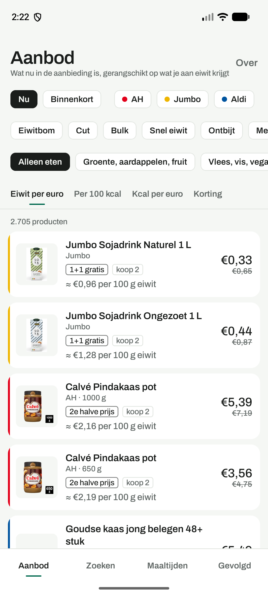
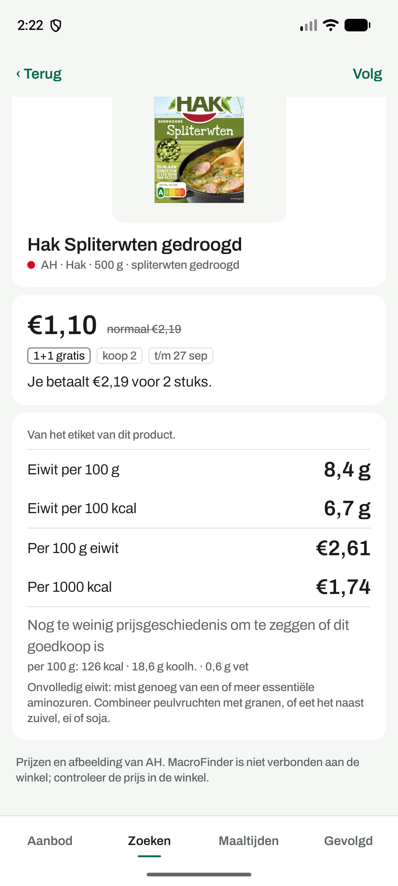

# MacroFinder

An Android app that ranks what's on offer at Albert Heijn, Jumbo and Aldi by how
much protein (or how many calories) you get per euro. It's built for people who
lift and shop on a budget, and it's honest about what it doesn't know.

The repo has two halves:

- `android/` is the app, in Kotlin and Jetpack Compose.
- `src/bonusrank/` is a Python CLI that scrapes the three chains, parses prices and
  nutrition, matches products to food types and builds the data the app reads.

## The app

| Deals | Product | Build a meal | Dark |
|---|---|---|---|
|  |  |  |  |

What it does:

- **Aanbod** lists this week's offers from all three chains. Sort by protein per
  euro, protein per 100 kcal, kcal per euro or discount. Filter by chain, shelf,
  now or next week, and by goal: *eiwitbom*, *cut*, *bulk*, *snel eiwit*,
  *ontbijt*, *meal prep*, *supplement*.
- **Product** shows the macro strip (protein per 100 g and per 100 kcal, cost per
  100 g protein and per 1000 kcal), the price history, whether it usually goes on
  offer again soon, and a note when the protein is incomplete.
- **Zoeken** searches the whole catalogue of about 52,000 products, on the phone,
  offline.
- **Maaltijden** lets you build a pasta or wrap from this week's cheapest
  parts, save it, and see it re-priced every week. It also compares ready-made
  protein products with making them yourself, including what you give up in taste.
- **Gevolgd** keeps products you follow and sends a notification when one goes on
  offer.

A few rules the app sticks to:

- A figure from the product's own label is shown plain. A figure estimated from a
  generic food table gets a ≈ and is shown in grey, however good it looks.
- Unknown stays unknown. Nothing is counted as zero, and a product with unknown
  macros sorts last instead of first.
- "1+1 gratis" always comes with "koop 2", because it means two in your fridge.
- It ranks, it doesn't choose for you.

The app is not affiliated with any of the chains. Prices and images come from
their public websites.

## Where the data comes from

There is no server. One GitHub Actions job runs twice a day, scrapes the chains,
and publishes everything to a release called `data-latest`:

| File | What | Size |
|---|---|---|
| `latest.json` | this week's ranked offers, meal templates, comparisons | ~1 MB |
| `macrofinder-*.sqlite` | the full catalogue with prices, macros and history | ~29 MB |
| `delta-*.sqlite` | what changed since an earlier build | a few hundred KB |
| `manifest.json` | which build is current, plus a chain of deltas | tiny |
| `history.sqlite3.gz` | the scraper's own database, carried between runs | ~7 MB |

The app downloads the catalogue once on wifi, then applies small deltas. Each
delta is checked on the build machine: applied to the previous build it has to
reproduce the new one byte for byte, or it isn't published. The catalogue crawl
(about 1,000 requests) only runs on Mondays; the other runs just refresh prices.

Nothing is committed by the bot. The app never talks to a supermarket directly, so
the chains see the same traffic whether one person uses it or a thousand.

## Repo layout

```
android/              the app
src/bonusrank/        the scraper and data pipeline
tests/                Python tests
data/seed/            hand-written reference data: food macros, shelves,
                      meal templates, macro buckets, protein quality
docs/BRIEF.md         the original brief and domain research
docs/PLAN-V2.md       the plan this was built from
docs/DESIGN.md        the visual design
docs/AUDIT.md         an audit of what actually worked, measured
CLAUDE.md             the engineering log: every endpoint, trap and decision
```

## Running it yourself

```bash
pip install -e ".[dev]"
bonusrank seed
bonusrank ingest --chain ah --with-macros 300
bonusrank prices --refresh --all --chain ah
bonusrank list --chain ah --sort protein-per-euro
bonusrank list --chain jumbo --upcoming
bonusrank catalogue --chain ah
bonusrank build-db --out-dir dist/data
```

The app builds with Gradle 8.7 and JDK 17:

```bash
cd android && gradle assembleDebug
```

CI uploads a debug APK on every run.

## Tests

Tests are kept separate from the code and all of them run in GitHub Actions.

- Python: about 820 tests (`pytest -q`), no network needed.
- Android, JVM: about 140 tests (`gradle testDebugUnitTest`). These include the
  catalogue SQL, run against the real published schema through sqlite-jdbc.
- Android, on a device: 19 tests (`gradle connectedDebugAndroidTest`) for the sync
  and the main screens. CI runs them on an emulator.

## Known limits

- Aldi only publishes its weekly offers, not a full catalogue, so Aldi products
  only appear while they're on offer.
- Price history started accumulating on 2026-09-26. "Cheapest in N weeks" and the
  promo cycle hints fill in as the weeks go by.
- Most macros are still estimates from a generic table. Label figures for AH
  products are added 300 at a time, twice a day.

This is a personal project built against undocumented endpoints, kept to two
requests a second per chain.
